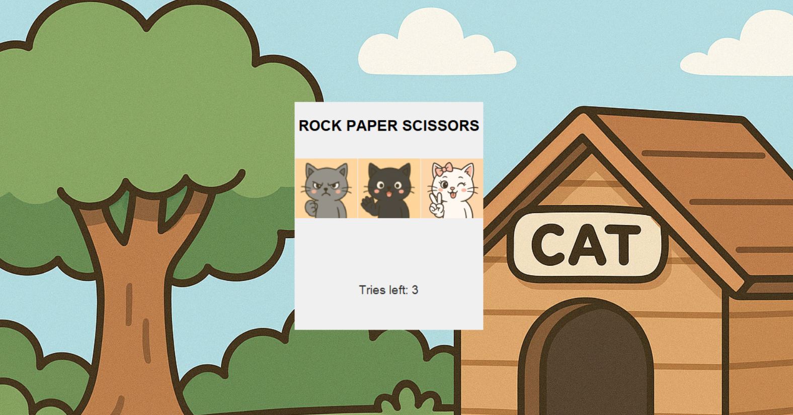

# Rock-Paper-Scissors Game

A simple desktop game built with **Python** and **Tkinter**, featuring an AI that predicts player moves. Inspired by the classic game from childhood, this version adds interactive elements and a friendly UI for an enjoyable experience.

## 🔹 Features

- **AI-Powered Opponent**: Predicts the player's next move based on previous choices.
- **User-Friendly Interface**: Clean and simple design using Tkinter.
- **Interactive Gameplay**: Includes animated buttons, background music, and a final countdown before displaying the game result.
- **Automatic Win Detection**: Game ends after a player wins two rounds or after three tries.

## 🔧 Technologies Used

- Python 3
- Tkinter – for GUI
- Pygame – for background music
- Playsound – for click sound effects
- Pillow (PIL) – for image handling if needed

## 🚀 How to Run

1. Clone the repository:
   ```bash
   git clone https://github.com/your-username/rock-paper-scissors-python.git
   cd rock-paper-scissors-python
Install dependencies:

bash
Copy
Edit
pip install pygame playsound pillow
Run the game:

bash
Copy
Edit
python main.py
📂 Required Files
Make sure these files are in the same folder as main.py:

rock.png

paper.png

scissors.png

backg.png

background.mp3

click.mp3

## 📷 Game Preview

The image below shows the final design of the game interface.  
*This screenshot is for preview purposes only and is not part of the code files.*


